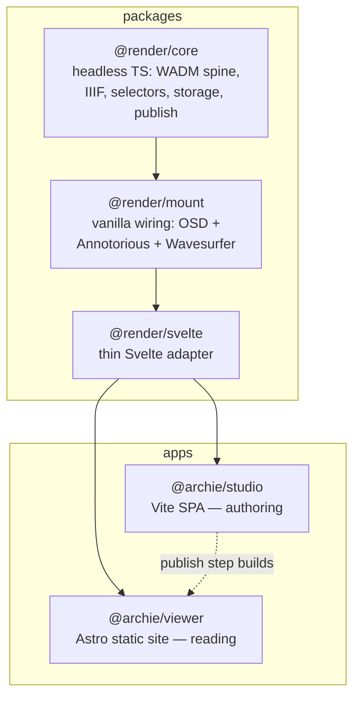

# Archie

**Annotate deep-zoom images, audio, and video in your browser — then publish a self-contained static site. No server, no database, no lock-in.**

---

Archie turns your media into interactive, linkable exhibits that live on the web as plain files. Author in the browser with the **Studio** SPA; publish produces a folder of HTML + JSON + media that drops onto any static host. Your notes are [W3C Web Annotation](https://www.w3.org/TR/annotation-model/) records, your exhibits are [IIIF Presentation 3](https://iiif.io/api/presentation/3.0/) manifests — portable, standards-based, and readable by third-party IIIF tools.

## What you can build

| You want to... | You do this in Archie |
|---|---|
| **Annotate a historic map** | Open the high-res image, draw regions, attach notes. Publish. Visitors explore your annotations on the map. |
| **Build a multimedia essay** | Combine images, audio clips, and video in one exhibit. Write a narrative spine that guides readers through each object. |
| **Create a scholarly edition** | Transcribe and annotate manuscript pages. Link notes to each other. Export as IIIF — readable in Mirador, Universal Viewer, or any IIIF tool. |
| **Publish without a server** | Author in the browser. Publish produces a folder of HTML + JSON + media. Drop it on GitHub Pages, Netlify, or any static host. |

The bundled exhibits — a Voynich manuscript set and a Bidar annotated map — show what a finished exhibit looks like.

## How it works

Archie has five domains that form the author's arc — from blank canvas to published site:

| Domain | What it does |
|---|---|
| **Exhibit Authoring** | Create libraries and exhibits, import media, arrange objects, draw annotation regions, write notes, organize narrative sections |
| **Annotation Spine** | Append-only annotation log with version-parent DAG — non-destructive edits, concurrent merge, full version history |
| **IIIF Publishing** | Project exhibits to IIIF Presentation 3 manifests and collections, build the static site tree, export portable `.archie.zip` archives |
| **Viewer Presentation** | Astro static shell renders any published library at runtime — gallery browse, deep-zoom reading, hash-based deep-linking, portable zip mode |
| **Media Processing** | EXIF orientation normalization (bakes upright display masters), AV transcript import (WebVTT/SRT → timed annotation notes) |

## Screenshots

> **New here?** The [**user guide**](docs/guide/) walks the whole arc — library → annotate → publish — using the bundled exhibits as worked examples. The screenshots below are figures from it.

### Studio — authoring


*Your library: every exhibit lives here. The bundled examples show what a finished exhibit looks like.*


*Exhibit overview: every object on one zoomable canvas — drag to pan, scroll to zoom, drag plates to set the reading order.*


*Image editor: draw rectangle or polygon regions on a deep-zoom object and annotate in the canvas-anchored popover; markers follow as you pan and zoom.*


*Audio editor: drag across the WaveSurfer waveform to mark a moment and attach a note; import VTT/SRT transcripts.*

### Viewer — published site


*Published exhibit: the Voynich folios as a live gallery — visitors open a folio, zoom in, and read your notes in place.*


*Narrative reading: the prose spine drives the canvas — each section frames its region of the exhibit map.*

## Quickstart

**Prerequisites:** Node.js ≥ 22 and pnpm 10.

```bash
pnpm install            # install the whole workspace
pnpm typecheck          # type-check every package + app
pnpm test               # run ~330 tests
```

### Run the Studio (authoring)

```bash
pnpm --filter @archie/studio dev      # opens http://localhost:5173
```

Pick or create an exhibit, draw a region, attach a note, publish.

### Run the Viewer (reading)

```bash
pnpm --filter @archie/viewer gen      # generate the published tree
pnpm --filter @archie/viewer dev      # opens http://localhost:4321
```

## Workflow — from clone to published site

**1. Clone and stand up the repo.**

```bash
git clone https://github.com/micahchoo/Archie.git archie && cd archie
nvm install 22 && nvm use 22
pnpm install
pnpm --filter @archie/studio dev   # opens http://localhost:5173
```

**2. Create an exhibit.** In the library home, type a title and create it. Open a bundled example to explore, then **Keep a copy** to fork it into a saved exhibit of your own.

**3. Add your objects.** Drop an image onto the canvas, or use **+ Object** on the rail to add an image, audio, or video object. The **exhibit overview** lays every object on one zoomable canvas — drag them to set the reading order.

**4. Annotate.** On an image or video, draw a rectangle/polygon region and write the note in the canvas-anchored popover; on audio, drag across the waveform to create a time-range note. Tag notes, group them into layers, and cite one note from another with <kbd>Cmd</kbd> + <kbd>K</kbd>.

**5. Write a narrative.** Switch to the narrative spine, add sections, and frame a camera on the canvas for each beat. Reorder sections and switch objects on the rail to shape the reading.

**6. Publish.** In the Studio, open **Publish** — download a `.archie.zip`, push to GitHub Pages, or (on Chromium) write directly to a local folder. A published site is a static tree that drops onto any host.

> [!TIP]
> **Run the apps locally for the full experience.** A published Pages site is read-only — visitors can read and navigate, but can't author or edit. Use **Studio** locally to build and revise, the local **Viewer** to read with full fidelity, and publish to Pages to share a public snapshot.

## Features

| Area | Capability |
|---|---|
| **Image annotation** | OpenSeadragon deep-zoom + Annotorious; rectangle and polygon regions; canvas-anchored popover form |
| **Audio annotation** | WaveSurfer waveform; drag to create time-range notes; import VTT/SRT transcripts |
| **Video annotation** | Spatiotemporal — draw a box on a paused frame + set a time window; combined `xywh=&t=` selectors |
| **Data model** | Append-only log with version-parent DAG; heads/history projection; non-destructive edits; multi-parent merge |
| **IIIF** | Exhibit → `Manifest`, object → `Canvas`, per-canvas `AnnotationPage`; layers as `AnnotationCollection`; narrative sections as `Range`; Presentation 3 on disk |
| **Storage** | Three backends behind one seam — OPFS (browser), `.archie.zip` (portable), File System Access (Chromium folder autosave) |
| **Linking** | <kbd>Cmd</kbd> + <kbd>K</kbd> cite/insert across the library; deep-link arrival (`#/a/<id>`); broken-link detection at publish |
| **Reading modes** | Single (deep-zoom), Grid (thumbnail gallery), Narrative (prose spine with camera framing); overview-as-canvas (zoomable exhibit map) |
| **Publish** | Whole-library → `.archie.zip` download, GitHub Pages push, or local folder (Chromium); portable Viewer reads zips directly |
| **Collaboration** | Silent DAG merge; conflict-card resolution; identity prompt on first import |
| **EXIF** | Read orientation, bake upright display master, preserve original with provenance metadata |

## Architecture

Archie is a pnpm monorepo. A three-layer rendering core (headless → vanilla DOM → Svelte) is shared by two apps that never depend on each other's code — only on the published `@render/*` contract.



| Workspace | Package | What it is |
|---|---|---|
| `packages/render-core` | `@render/core` | Pure TypeScript: WADM types, annotation spine, IIIF manifests, selectors, storage seam, publish, EXIF, linking, A/V. No DOM. |
| `packages/render-mount` | `@render/mount` | Framework-free wiring of OpenSeadragon + Annotorious + Wavesurfer behind an imperative surface. |
| `packages/render-svelte` | `@render/svelte` | Thin Svelte 5 reactivity adapter over `@render/mount`. |
| `apps/studio` | `@archie/studio` | Authoring SPA — library browser, canvas editor, A/V editor, merge review, publish dialog. |
| `apps/viewer` | `@archie/viewer` | Published reader — Astro with Svelte islands, gallery landing, per-exhibit readers. |

### Where to start in the code

- `packages/render-core/src/wadm/types.ts` — the W3C annotation types
- `packages/render-core/src/model/model.ts` — Library, Exhibit, Object, Note domain model
- `packages/render-core/src/spine/log.ts` — append-only annotation log
- `packages/render-core/src/index.ts` — the barrel export (34 re-exports)
- `apps/studio/src/store.ts` — the Studio's OPFS working store

Additional maps: [`docs/architecture/`](docs/architecture/) (subsystem components + contracts), [`docs/adr/`](docs/adr/) (ADRs 0001–0010), [`CONTEXT.md`](CONTEXT.md) (full domain glossary).

## Core concepts

Archie uses a precise vocabulary. One-sentence definitions below; full glossary in [`CONTEXT.md`](CONTEXT.md).

- **Library** — top-level container for one project; on disk a directory or zip; an IIIF `Collection`.
- **Exhibit** — one published narrative artifact; an IIIF `Manifest`. Owns its objects, media, notes, and narrative.
- **Object** — one media item inside an Exhibit (image / audio / video / embed); an IIIF `Canvas`.
- **Note** — a single W3C WADM `Annotation`, targeting a library, exhibit, object, region, or time-range.
- **Reading** — a named, mutually-exclusive interpretive pass (e.g. "cipher" vs "hoax"); an IIIF `AnnotationCollection`. The reader switches between readings to re-frame the canvas.
- **Tag** — a lightweight ad-hoc label on a single Note for cross-cutting discovery; additive, per-note.
- **Section** — one ordered unit of an exhibit's narrative; an IIIF `Range`.
- **Studio** / **Viewer** — the authoring app / the read-only published site.

## Status

**v1 nearly complete.** The data layer, both apps, and all major features are built and dogfooded on Voynich (5-folio manuscript) and Bidar (25-region annotated map) exhibits. ~330 tests across all packages.

**Shipped:** overview-as-canvas with drag-to-reorder, narrative section-authoring with camera framing, audio and video annotation, canvas-anchored note popover, <kbd>Cmd</kbd> + <kbd>K</kbd> intra-library linking, EXIF display-master bake, three-config persistence (OPFS / folder autosave / `.archie.zip`), playground-vs-project model, layout picker, identity prompt, portable Viewer zip mode.

**Owed:** GH-Pages publish end-to-end verification, browser-regression pass on AV editor and persistence flows, Viewer IIIF Content-State arrival, grid slideshow sub-mode.

Full phasing: [`docs/IMPLEMENTATION-STRATEGY.md`](docs/IMPLEMENTATION-STRATEGY.md).

## Documentation

| Doc | For |
|---|---|
| [`docs/guide/`](docs/guide/) | **Users** — a screenshot walkthrough from library to published site |
| [`CONTEXT.md`](CONTEXT.md) | Domain language, locked design frames, full glossary |
| [`docs/architecture/overview.md`](docs/architecture/overview.md) | Architecture map (start here as a developer) |
| [`docs/architecture/subsystems/`](docs/architecture/subsystems/) | Per-subsystem component + contract maps |
| [`docs/adr/`](docs/adr/) | Architecture Decision Records (0001–0010) |
| [`docs/IMPLEMENTATION-STRATEGY.md`](docs/IMPLEMENTATION-STRATEGY.md) | Phasing, sequencing, validation gates |

## Contributing

Pull requests are welcome. Before opening one:

1. Run `pnpm typecheck` and `pnpm test` — both must pass.
2. For new features, include tests. The suite lives alongside source (`*.test.ts`), not in a separate directory.
3. Architecture decisions go in `docs/adr/` (new) or `docs/decisions/` (Q-N citation). Design discussion belongs in an issue before a PR.
4. The rendering core (`@render/core`) is pure TypeScript with no DOM dependencies — keep it that way. Browser APIs belong in `@render/mount` or the apps.

## License

No license file is present yet. Until a `LICENSE` is added, all rights are reserved by the authors; contact the maintainers before reuse.
