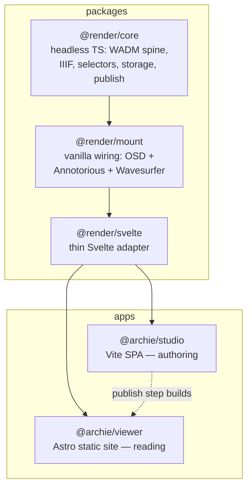

# Archie

**Annotate deep-zoom images, audio, and video in your browser — then publish a self-contained static site. No server, no database, no lock-in.**

---

## What you can build

Archie turns your media into interactive, linkable exhibits that live on the web as plain files.

| You want to... | You do this in Archie |
|---|---|
| **Annotate a historic map** | Open the high-res image, draw regions, attach notes. Publish. Visitors explore your annotations on the map. |
| **Build a multimedia essay** | Combine images, audio clips, and video in one exhibit. Write a narrative spine that guides readers through each object. |
| **Create a scholarly edition** | Transcribe and annotate manuscript pages. Link notes to each other. Export as IIIF — readable in Mirador, Universal Viewer, or any IIIF tool. |
| **Publish without a server** | Author in the browser. Publish produces a folder of HTML + JSON + media. Drop it on GitHub Pages, Netlify, or any static host. |

The bundled exhibits — a 5-folio Voynich manuscript set and a 25-region Bidar map — show what a finished exhibit looks like.

> [!NOTE]
> **Status: Phase 2 in progress.** The data layer and both apps are built and dogfooded. Browser-regression verification is pending; several Phase 3 features are not yet built — see [Status & roadmap](#status--roadmap).

## Why Archie

- **Standards on disk, not in a vendor format.** Notes are [W3C Web Annotation](https://www.w3.org/TR/annotation-model/) records. Exhibits are [IIIF Presentation 3](https://iiif.io/api/presentation/3.0/) manifests. Your work is portable and readable by third-party IIIF tools.
- **Static output.** Publish produces a folder (or `.archie.zip`) that drops onto GitHub Pages, Netlify, or any static host. The Viewer needs no backend.
- **Multi-media, multi-object.** One exhibit holds many images, audio, and video objects, with notes at the library, exhibit, object, region, and time-range level.
- **Linkable, navigable notes.** Cite one note from another (<kbd>Cmd</kbd> + <kbd>K</kbd>), deep-link to a region (`#/a/<id>`), and let visitors move through prose-led or object-led readings.
- **Versioned by design.** Annotations live on an append-only log with a version-parent DAG. Edits are non-destructive and concurrent changes can be merged.

## Quickstart

**Prerequisites:** Node.js ≥ 22 and pnpm 10.

```bash
pnpm install            # install the whole workspace
pnpm typecheck          # type-check every package + app
pnpm test               # run ~290 tests
```

### Run the Studio (authoring)

```bash
pnpm --filter @archie/studio dev      # opens http://localhost:5173
```

Pick or create an exhibit, draw a region, attach a note, publish.

### Run the Viewer (reading)

```bash
pnpm --filter @archie/viewer gen      # generate the published tree
pnpm --filter @archie/viewer dev      # opens http://localhost:4321
```

Target a single workspace with `--filter`, e.g. `pnpm --filter @render/core test`.

## Features

| Area | Capability |
|---|---|
| **Image annotation** | OpenSeadragon deep-zoom + Annotorious; rectangle, polygon, ellipse, path regions |
| **A/V annotation** | Import VTT/SRT transcripts, mark time-range notes, click-to-seek |
| **Data model** | Append-only log with version DAG; heads/history projection; non-destructive edits; multi-parent merge |
| **IIIF** | Exhibit → `Manifest`, object → `Canvas`, per-canvas `AnnotationPage` heads; Presentation 3 on disk |
| **Storage** | Three backends behind one seam — in-memory, `.archie.zip`, File System Access (Chromium autosave) |
| **EXIF** | Read orientation, generate upright display master, preserve original |
| **Linking** | Cite/insert across the library, deep-link arrival, link validation |
| **Reading modes** | Single (OSD + 3-state pane), Grid (object gallery), Narrative (prose spine) |
| **Publish** | Library → `.archie.zip` download or GitHub Pages push |

## Installation

```bash
pnpm install
```

> [!IMPORTANT]
> The repo requires Node.js ≥ 22. Older versions fail with a version-engine error. Switch first: `nvm install 22 && nvm use 22`.

## Architecture

Archie is a pnpm monorepo. A three-layer rendering core (headless → vanilla DOM → Svelte) is shared by two apps that never depend on each other's code — only on the published `@render/*` contract.



| Workspace | Package | What it is |
|---|---|---|
| `packages/render-core` | `@render/core` | Pure TypeScript: WADM types, annotation spine, IIIF manifests, selectors, storage seam, publish, EXIF, linking, A/V. No DOM. (60 source files) |
| `packages/render-mount` | `@render/mount` | Framework-free wiring of OpenSeadragon + Annotorious + Wavesurfer behind an imperative surface. (11 source files) |
| `packages/render-svelte` | `@render/svelte` | Thin Svelte 5 reactivity adapter over `@render/mount`. (9 source files) |
| `apps/studio` | `@archie/studio` | Authoring SPA — library browser, canvas editor, A/V editor, merge review, publish dialog. |
| `apps/viewer` | `@archie/viewer` | Published reader — Astro with Svelte islands, gallery landing, per-exhibit readers. |

### Where to start in the code

**Understanding the data model** (work inward from the edges):
- `packages/render-core/src/wadm/types.ts` — the W3C annotation types
- `packages/render-core/src/wadm/brand.ts` — branded ULID identity types (LogicalId, RevId, VersionId) that prevent type confusion
- `packages/render-core/src/model/model.ts` — Library, Exhibit, Object, Note domain model

**Understanding the annotation spine** (the versioning core):
- `packages/render-core/src/spine/log.ts` — append-only log (highest-degree node in the graph: 14 edges)
- `packages/render-core/src/spine/heads.ts` — multi-head projection for concurrency
- `packages/render-core/src/spine/merge.ts` — three-way merge resolution
- `packages/render-core/src/spine/serialize.ts` — on-disk persistence format

**Understanding how it all wires together**:
- `packages/render-core/src/index.ts` — the barrel export (34 re-exports, the codebase map)
- `packages/render-core/src/fs/seam.ts` — the filesystem abstraction (3 backends, 1 interface)
- `packages/render-mount/src/mount.ts` — where OSD + Annotorious get wired to the render surface
- `apps/studio/src/store.ts` — the Studio's OPFS working store (where core packages meet the authoring UI)

**Additional maps:** [`docs/architecture/`](docs/architecture/) (subsystem components + contracts), [`docs/adr/`](docs/adr/) (ADRs), [`docs/decisions/`](docs/decisions/) (Q-N decision records).

## Core concepts

Archie uses a precise vocabulary. One-sentence definitions below; full glossary in [`CONTEXT.md`](CONTEXT.md).

- **Library** — top-level container for one project; on disk a directory or zip; an IIIF `Collection`.
- **Exhibit** — one published narrative artifact; an IIIF `Manifest`. Owns its objects, media, notes, and narrative.
- **Object** — one media item inside an exhibit (image / audio / video / embed); an IIIF `Canvas`.
- **Note** — a single WADM `Annotation`, targeting a library, exhibit, object, region, or time-range.
- **Layer** — a named, toggleable grouping of notes with editorial intent; an IIIF `AnnotationCollection`.
- **Section** — one ordered unit of an exhibit's narrative; an IIIF `Range`. Independent of Notes — Sections point at Notes via links, not structural references.
- **Studio** / **Viewer** — the authoring app / the read-only published site.

## Status & roadmap

**Tests:** ~290 tests (241 `@render/core`, 18 `@render/mount`, 18 `@render/svelte`). Requires Node ≥ 22.

**Phase 2 — in progress.** Both apps built and dogfooded on Voynich and Bidar exhibits. Owed: browser-regression verification, styled A/V scrubber, publish-originals opt-in, broken-links surface.

**Phase 3 — not yet built:**
- Overview-as-canvas (zoomable exhibit overview instead of a list)
- Local identity prompt on first import
- Grid slideshow sub-mode
- Narrative section-authoring UI
- Viewer breadcrumb / zoom-to-fit chrome, IIIF Content-State arrival

The phasing and gate mechanism is in [`docs/IMPLEMENTATION-STRATEGY.md`](docs/IMPLEMENTATION-STRATEGY.md).

## Documentation

| Doc | For |
|---|---|
| [`CONTEXT.md`](CONTEXT.md) | Domain language, locked design frames, full glossary |
| [`docs/README.md`](docs/README.md) | Index to all design docs |
| [`docs/architecture/overview.md`](docs/architecture/overview.md) | Architecture map (start here as a developer) |
| [`docs/architecture/subsystems/`](docs/architecture/subsystems/) | Per-subsystem component + contract maps |
| [`docs/adr/`](docs/adr/) | Architecture Decision Records (0001–0005) |
| [`docs/decisions/`](docs/decisions/) | Citable decision records (Q-N) |
| [`docs/IMPLEMENTATION-STRATEGY.md`](docs/IMPLEMENTATION-STRATEGY.md) | Phasing, sequencing, validation gates |
| [`HANDOFF.md`](HANDOFF.md) | Agent-to-agent session continuity |

## Contributing

Pull requests are welcome. Before opening one:

1. Run `pnpm typecheck` and `pnpm test` — both must pass.
2. For new features, include tests. The suite lives alongside source (`*.test.ts`), not in a separate directory.
3. Architecture decisions go in `docs/adr/` (new) or `docs/decisions/` (Q-N citation). Design discussion belongs in an issue before a PR.
4. The rendering core (`@render/core`) is pure TypeScript with no DOM dependencies — keep it that way. Browser APIs belong in `@render/mount` or the apps.

See [`docs/architecture/overview.md`](docs/architecture/overview.md) for the subsystem map and [`CONTEXT.md`](CONTEXT.md) for the domain language used throughout the codebase.

## License

No license file is present yet. Until a `LICENSE` is added, all rights are reserved by the authors; contact the maintainers before reuse.
