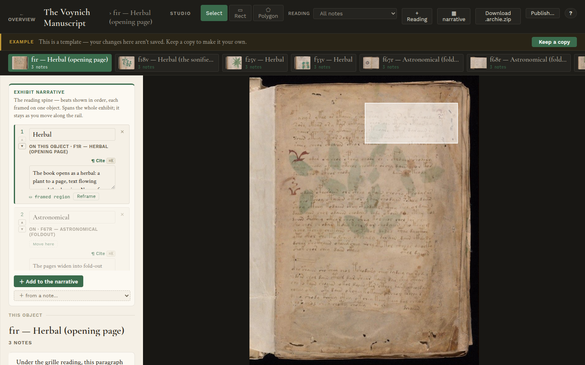
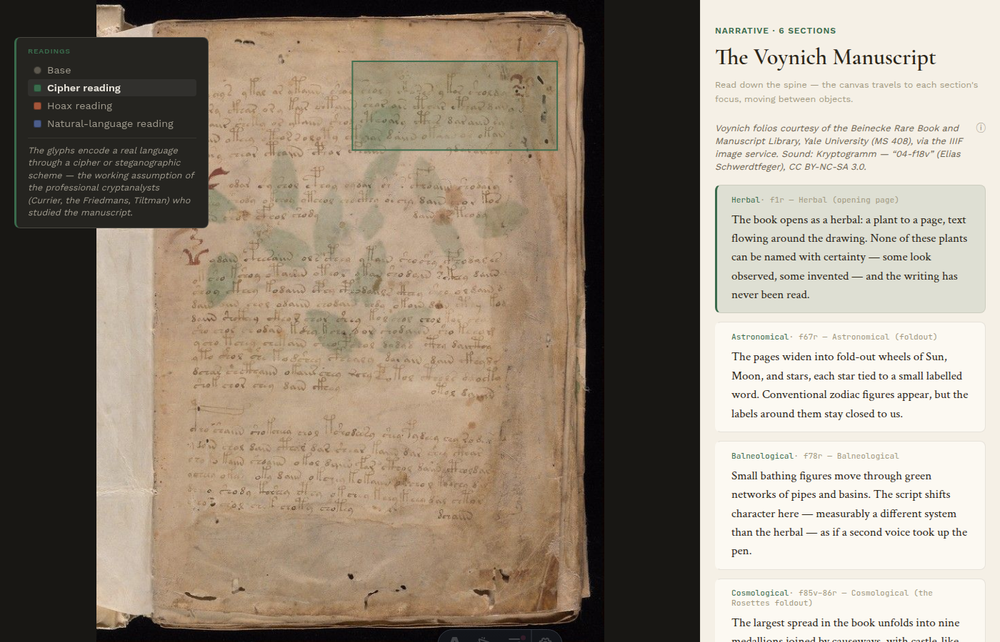
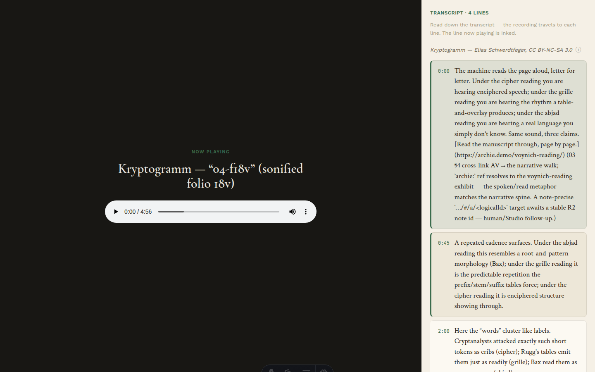
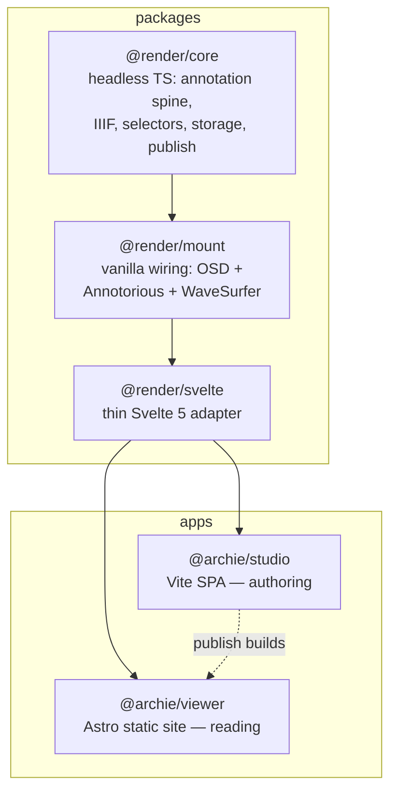

# Archie

**Annotate deep-zoom images, maps, audio, and video in your browser — then publish a self-contained static site. No server, no database, no lock-in.**


*A published Archie library. You author in the browser; visitors get plain HTML, JSON, and media files that work offline and never phone home.*

---

## Contents

- [What it is](#what-it-is)
- [How it works](#how-it-works)
- [What you can build](#what-you-can-build)
- [See it in action](#see-it-in-action)
- [Archie in use — a real project](#archie-in-use--a-real-project)
- [Quickstart](#quickstart)
- [The bundled demo](#the-bundled-demo)
- [Core concepts](#core-concepts)
- [Features](#features)
- [Publishing & deploying](#publishing--deploying)
- [Architecture](#architecture)
- [Status & roadmap](#status--roadmap)
- [Documentation](#documentation)
- [Contributing](#contributing) · [License](#license)

## What it is

Archie is a static-publishable, multi-media exhibit annotation platform. You annotate deep-zoom images, maps, audio, and video in a browser-based **Studio**, then publish a self-contained static site — the **Viewer** — that drops onto GitHub Pages, Netlify, or any static host.

Your work is built on open standards, on disk, not in a vendor format:

- **Notes are [W3C Web Annotations](https://www.w3.org/TR/annotation-model/).** Exhibits are [IIIF Presentation 3](https://iiif.io/api/presentation/3.0/) manifests. Third-party IIIF tools (Mirador, Universal Viewer) can read your work directly.
- **The published site has no backend.** A folder of files — or a single `.archie.zip` — is the whole artifact.
- **One exhibit holds many objects** (images, maps, audio, video) with notes at the library, exhibit, object, region, time-range, and geographic level.
- **Notes are versioned and linkable.** Annotations live on an append-only log with a version-parent DAG; edits are non-destructive and concurrent changes merge. Cite one note from another, deep-link to a region, and let visitors read prose-led or object-led.

## How it works

Archie has five domains that form the author's arc — from blank canvas to published site:

| Domain | What it does |
|---|---|
| **Exhibit Authoring** | Create libraries and exhibits, import media, add map basemaps, arrange objects, draw annotation regions, write notes, organize narrative sections |
| **Annotation Spine** | Append-only annotation log with version-parent DAG — non-destructive edits, concurrent merge, full version history |
| **IIIF Publishing** | Project exhibits to IIIF Presentation 3 manifests and collections, build the static site tree, export portable `.archie.zip` archives |
| **Viewer Presentation** | Astro static shell renders any published library at runtime — gallery browse, deep-zoom reading, hash-based deep-linking, portable zip mode |
| **Media Processing** | EXIF orientation normalization (bakes upright display masters), AV transcript import (WebVTT/SRT → timed annotation notes) |

## What you can build

| You want to… | You do this in Archie |
|---|---|
| **Annotate a historic map or manuscript** | Open the high-res image, draw rectangle or polygon regions, attach notes. Publish. Visitors explore your annotations in place. |
| **Map a place or a fieldwork site** | Add a **map** object — a basemap (OpenStreetMap / Carto) framed to the region you care about — then draw **Box** or **Outline** regions anchored to real longitude/latitude. Re-frame the map and the regions stay nailed to the Earth. |
| **Present competing interpretations** | Give the same object several **Readings** — a *cipher* reading vs a *hoax* reading — and let the visitor switch between them. |
| **Build a multimedia essay** | Combine images, audio, and video in one exhibit; write a narrative spine that walks a reader from object to object. |
| **Create a scholarly edition** | Transcribe and annotate pages, cite notes from notes, credit sources with IIIF rights metadata. Export readable in any IIIF tool. |
| **Publish without a server** | Author in the browser; publish a folder of HTML + JSON + media to any static host. |

## See it in action

**Studio — authoring.** Your library holds every exhibit. Open one and you land on a zoomable overview of its objects (drag to set the reading order); click an object to annotate it up close.



*Draw a region on a deep-zoom object and write the note in the popover anchored to the marker; the marker follows as you pan and zoom.*

**Viewer — competing Readings.** A **Reading** is one interpretive pass over an object. The legend is a radio: the reader picks one and the canvas re-frames. Pure IIIF viewers see each Reading as a real, toggleable annotation layer.



*The reader arrives on the neutral **Base** notes, then enters a Reading — Cipher, Grille, or Natural-language — and watches the same marks get read a different way.*

**Audio, video, and credits.** Audio and video objects play inline with a transcript spine; a quiet credit line carries the IIIF attribution, with full license details behind an ⓘ disclosure.



*A sounded folio: play the recording, read down the transcript, each line seeking the audio. The credit line ("Kryptogramm — Elias Schwerdtfeger, CC BY-NC-SA 3.0") is published as a IIIF `requiredStatement`.*

> The [**user guide**](docs/guide/) walks the whole arc — library → annotate → publish — using the bundled exhibits as worked examples.

## Archie in use


*A narrative reading: the prose spine drives the canvas, framing a region of the map for each beat, with field photos and recordings inline.*


*Authoring a video note: draw a box on a frame and set a time window — a combined spatiotemporal selector.*


*Authoring an audio note: drag across the waveform to mark a stretch, write the note, and import a VTT/SRT transcript.*

## Quickstart

**Easiest way (no command-line experience needed):** after cloning or downloading the repo, run the launcher for your system — `start.cmd` on Windows (double-click), `start.command` on macOS (double-click), `start.sh` on Linux. It checks your Node.js version, installs everything on first run, and offers a menu to start the Studio, the Viewer, or both — opening each in your browser when ready. The only prerequisite is [Node.js](https://nodejs.org) 22 or newer.

**Manual way:**

**Prerequisites:** Node.js 22 or newer (CI builds on Node 24) and pnpm 10.

```bash
pnpm install            # install the whole workspace
pnpm typecheck          # type-check every package + app
pnpm test               # run the test suite (~550 tests)
```

**Run both apps (recommended):**

```bash
node scripts/start.mjs both           # or: bash scripts/dev.sh
```

One front door at **http://localhost:5173** — the Studio at [`/studio/`](http://localhost:5173/studio/), the Viewer at [`/viewer/`](http://localhost:5173/viewer/), mirroring the deployed layout. Running both on **one origin** is what makes the live loop work (see [Author locally, see it live](#author-locally-see-it-live) below). Don't start the two dev servers separately if you want that loop — separate ports are separate origins, and the Viewer can't see the Studio's working store across origins.

**Run one app alone:**

```bash
pnpm --filter @archie/studio dev      # Studio only → http://localhost:5174/studio/
pnpm --filter @archie/viewer dev      # Viewer only → http://localhost:4321 (gen runs first)
```

Pick or create an exhibit, draw a region, attach a note. Target a single workspace with `--filter`, e.g. `pnpm --filter @render/core test`.

> [!IMPORTANT]
> The repo needs Node.js 22+. Older versions fail with a `node:sqlite` engine error inside pnpm. Switch first — e.g. `fnm use 24` or `nvm install 24 && nvm use 24`.

## Author locally, see it live

Clone the repo, create exhibits, and watch them appear in the Viewer — **no publish step, no import**:

1. Start both apps behind the front door: `node scripts/start.mjs both` (menu option 3).
2. Author in the **Studio** (http://localhost:5173/studio/) — create an exhibit, import an image folder, draw regions, write notes. Your work autosaves to the browser's private storage.
3. Open (or reload) the **Viewer** (http://localhost:5173/viewer/) — your exhibit is in the hall, marked **Local**, alongside the bundled published exhibits.

This works because the Studio and the Viewer are two apps over **one canonical store**: served from the same origin, the Viewer reads the Studio's working copy directly and projects it through the same pipeline a real publish uses. The same loop works on a deployed co-deploy (GitHub Pages serves `/studio/` and `/viewer/` from one origin too).

The **Local** badge marks the boundary: *local* means only you can see it, in this browser. **Publish** is what makes an exhibit public and citable — it bakes the static tree (IIIF manifests, durable per-note anchors), which you commit and deploy. Committed exhibits in `apps/viewer/public/published/` survive regeneration: the generator rewrites only the bundled samples and carries everything else, so publishing your own exhibits into the tree and deploying them is safe.

Caveats: the live loop reads the browser-private (OPFS) working store, so it covers unbound projects in v1 — a project bound to a folder or `.archie.zip` shows in the Viewer after a publish instead. New exhibits appear when the Viewer loads; reload the tab to pick up fresh edits.

## The bundled demo

Archie ships with **The Archie Library**: the Voynich manuscript (Beinecke MS 408) reframed as a *contested object* — the same undeciphered marks read three ways (cipher, grille, natural-language) across three exhibits, one per layout:

| Exhibit | Layout | What it shows |
|---|---|---|
| **The Rosettes** | Single | One deep-zoom folio (the Rosettes foldout), read three ways over one canvas. |
| **The Whole Manuscript** | Grid | All eleven folios across six sections, each readable three ways, plus a sounded page (audio). |
| **Reading the Unreadable** | Narrative | A prose walk through the manuscript's divisions, pausing to read each page three ways. |

> [!NOTE]
> **IIIF manifest URLs.** The three bundled exhibits are published as IIIF Presentation 3 manifests. Paste these URLs into [Mirador](https://projectmirador.org/), [Universal Viewer](https://universalviewer.io/), [Clover](https://samvera-labs.github.io/clover-iiif/), or any IIIF viewer — they resolve to the live GitHub Pages deployment:
> - `https://micahchoo.github.io/Archie/viewer/published/voynich/manifest.json`
> - `https://micahchoo.github.io/Archie/viewer/published/voynich-reading/manifest.json`
> - `https://micahchoo.github.io/Archie/viewer/published/voynich-rosettes/manifest.json`
> The base URL is configured in [`scripts/build-gh-pages.sh`](scripts/build-gh-pages.sh) via `PUBLISH_BASE`.

Folio images are pulled live from [Yale's Beinecke IIIF service](https://collections.library.yale.edu/), so the demo also exercises Archie's external-IIIF path. Opening a bundled exhibit is a **playground** — nothing is saved until you **Keep a copy** to fork it into an exhibit of your own.

## Core concepts

Archie uses a precise vocabulary. One-sentence definitions below; the full glossary is in [`CONTEXT.md`](CONTEXT.md).

- **Library** — top-level container for one project; on disk a directory or zip; an IIIF `Collection`.
- **Exhibit** — one published narrative artifact; an IIIF `Manifest`. Owns its objects, media, notes, and narrative.
- **Object** — one media item inside an exhibit (image / map / audio / video); an IIIF `Canvas`.
- **Map** — a fourth Object *medium*: an Object whose surface is a slippy-map **basemap** (OpenStreetMap / Carto XYZ tiles) on the same deep-zoom canvas as an image. Geo-regions target it as **Box** or **Outline** shapes whose **longitude/latitude is the source of truth** — the pixel selector is derived, so re-framing the map keeps regions fixed to the Earth (*geo-truth*). Regions only, no pins. See [ADR-0015](docs/adr/0015-map-medium-bounded-extent.md).
- **Map extent** — a Map's bounded geographic region (`[west, south, east, north]`): the absolute frame the reader cannot pan past, set when the map is added. It is to a Map what `width`/`height` are to an image.
- **Note** — a single W3C `Annotation`, targeting a library, exhibit, object, region, time-range, or a geographic region on a Map.
- **Reading** — a curated, **mutually exclusive** interpretive pass over an object (e.g. *cipher* vs *hoax*); an IIIF `AnnotationPage` per object, grouped by an `AnnotationCollection`. The reader switches between Readings; only one shows at a time.
- **Tag** — a lightweight, **additive** label on a note (a motif, a paleographic note); a flat filter chip with no curation. The deliberate inverse of a Reading.
- **Section** — one ordered unit of an exhibit's narrative; an IIIF `Range`. Frames a camera on an object; the spine may switch objects across sections.
- **Studio** / **Viewer** — the authoring app / the read-only published site.

> **Note:** earlier versions called Readings and Tags both "Layers." "Layer" was retired because it did two jobs at once; see [ADR-0007](docs/adr/0007-readings-as-annotationpages.md).

## Features

| Area | Capability |
|---|---|
| **Image annotation** | OpenSeadragon deep-zoom + Annotorious; rectangle and polygon regions; canvas-anchored popover form |
| **Audio annotation** | WaveSurfer waveform; drag to create time-range notes; import VTT/SRT transcripts |
| **Video annotation** | Spatiotemporal — draw a box on a paused frame + set a time window; combined `xywh=&t=` selectors |
| **Map annotation** | Slippy-map basemap (OpenStreetMap / Carto XYZ tiles) on a bounded extent; **Box / Outline** geo-regions anchored by true lng/lat (*geo-truth* — re-framing keeps regions earth-fixed); coordinate readout in Studio + Viewer; required basemap attribution |
| **Readings & Tags** | Readings = mutually-exclusive interpretive passes (IIIF AnnotationPages — real toggleable layers in any IIIF viewer); Tags = additive per-note discovery chips |
| **Rights & metadata** | IIIF `requiredStatement` (credit) + `rights` (license URI) at library / exhibit / object level, with opt-in inheritance; one quiet credit line + an ⓘ disclosure in the Viewer |
| **Data model** | Append-only log with version-parent DAG; heads/history projection; non-destructive edits; multi-parent merge; schema migration |
| **IIIF** | Exhibit → `Manifest`, object → `Canvas`, per-canvas `AnnotationPage`; Readings as `AnnotationCollection`; sections as `Range`; Presentation 3 on disk |
| **Storage** | Three backends behind one seam — OPFS (browser), `.archie.zip` (portable), File System Access (Chromium folder autosave) |
| **Linking** | <kbd>Cmd</kbd> + <kbd>K</kbd> cite/insert across the library; deep-link arrival (`#/a/<id>`); broken-link detection at publish |
| **Reading modes** | Single (deep-zoom), Grid (thumbnail gallery), Narrative (prose spine with camera framing); overview-as-canvas with drag-to-reorder |
| **Publish** | Whole-library → `.archie.zip`, GitHub Pages, or a local folder (Chromium); opt-in source-originals for citation |
| **Portable Viewer** | One Viewer shell, two modes — render a hosted published tree, or open an `.archie.zip` a recipient was handed, entirely in-browser |
| **EXIF** | Read orientation, bake an upright display master, preserve the original with provenance metadata |
| **Collaboration** | Silent DAG merge; conflict-card resolution; identity prompt on first import |

## Publishing & deploying

Publishing projects your **whole library** into a static site. There are two complementary paths:

**1. Deploy the full site (recommended).** A GitHub Actions workflow ([`.github/workflows/deploy.yml`](.github/workflows/deploy.yml)) builds both apps on push to `main` via [`scripts/build-gh-pages.sh`](scripts/build-gh-pages.sh) and deploys a self-contained site: a landing page linking the **Studio** (`/studio/`) and the **Viewer** (`/viewer/`), with the bundled published data baked in.

```bash
pnpm build:gh-pages     # produces ./gh-pages-dist (studio + viewer + landing)
```

> [!NOTE]
> `build-gh-pages.sh` hardcodes `REPO="Archie"` for the base paths (`/Archie/studio/`, `/Archie/viewer/`). If you fork under a different repo name, change that variable.

**2. Push content from the Studio.** The Studio's **Publish → Connect to GitHub** pushes your library's *data tree* (IIIF manifests, annotations, media, `exhibits.json`) to a branch via the GitHub Contents API — useful for updating content without a full rebuild. Enter your repo owner/name, a branch (defaults to `gh-pages`), and a [fine-grained token](https://github.com/settings/tokens?type=beta) with **`Contents: write`** (and **`Pages: write`** to let Archie switch Pages on for you). The token is used once and never stored.

You can also publish a portable **`.archie.zip`** (no host at all) and hand it to someone — the Viewer opens it in-browser.

> [!TIP]
> A published Pages site is **read-only**: visitors read and navigate, but can't author. For the best experience while building, run the Studio and Viewer locally; publish to share a public snapshot.

## Architecture

Archie is a pnpm monorepo. A three-layer rendering core (headless → vanilla DOM → Svelte) is shared by two apps that never depend on each other's code — only on the published `@render/*` contract.



| Workspace | Package | What it is |
|---|---|---|
| `packages/render-core` | `@render/core` | Pure TypeScript: annotation spine, IIIF projection, selectors, storage seam, publish, EXIF, linking, A/V. No DOM. |
| `packages/render-mount` | `@render/mount` | Framework-free wiring of OpenSeadragon + Annotorious + WaveSurfer behind an imperative surface. |
| `packages/render-svelte` | `@render/svelte` | Thin Svelte 5 reactivity adapter over `@render/mount`. |
| `apps/studio` | `@archie/studio` | Authoring SPA — library browser, canvas editor, A/V editor, merge review, publish dialog. |
| `apps/viewer` | `@archie/viewer` | Published reader — Astro with Svelte islands, gallery landing, per-exhibit readers, portable-zip mode. |

### Where to start in the code

- **The data model:** `packages/render-core/src/wadm/types.ts` — the W3C annotation types every module speaks.
- **The annotation spine (the core innovation, [ADR-0003](docs/adr/0003-annotation-spine-append-only-version-dag.md)):** `spine/log.ts` (append-only log), `spine/heads.ts` (multi-head projection), `spine/merge.ts` (three-way merge), `session/session.ts` (transactional CRUD).
- **How it wires together:** `packages/render-core/src/index.ts` (barrel export), `fs/seam.ts` (three storage backends, one interface), `apps/studio/src/binding.ts` (the three-config persistence system), `publish/site.ts` (the publishing engine).
- **The map medium (geo-annotation, [ADR-0015](docs/adr/0015-map-medium-bounded-extent.md)):** `geometry/geo.ts` (lng/lat ↔ world-pixel, bounded extent), `iiif/resolve.ts` (XYZ tile source), with the `archie:geo` anchor threaded through the spine and the IIIF manifest; `apps/studio/src/AddMapModal.svelte` is the add-map flow.

**Additional maps:** [`docs/architecture/`](docs/architecture/), [`docs/adr/`](docs/adr/) (ADRs 0001–0015), [`docs/decisions/`](docs/decisions/) (Q-N decision records), and a generated knowledge graph in [`.understand-anything/`](.understand-anything/).

## Status & roadmap

**Tests:** ~550 across the workspace (≈490 `@render/core`, 31 `@render/mount`, 19 `@render/svelte`, plus Viewer tests). Run `pnpm test`.

**v1 — complete and dogfooded.** The data layer, both apps, and all major features are built and verified on the Voynich (Beinecke MS 408) demo and a real Bidar fieldwork project. Both apps build clean.

**Shipped:** image / audio / video annotation · **map annotation** (geo-regions anchored by true lng/lat — [ADR-0015](docs/adr/0015-map-medium-bounded-extent.md)) · Readings & Tags · IIIF rights & metadata · narrative section authoring · overview-as-canvas with drag-to-reorder · <kbd>Cmd</kbd> + <kbd>K</kbd> intra-library linking · EXIF display-master bake · three-config persistence (OPFS / folder / zip) · portable Viewer · playground-vs-project model · streaming-zip save and import downscale for large media.

**On the v1.1 frontier:** progressive marker reveal in narrative reading · reading modes (scrollytelling, compare, slideshow) · ellipse / freehand shapes · image-aware overlay contrast. The canonical remaining-work list is the deferred-work registry in [`docs/IMPLEMENTATION-STRATEGY.md`](docs/IMPLEMENTATION-STRATEGY.md).

## Documentation

| Doc | For |
|---|---|
| [`docs/guide/`](docs/guide/) | **Users** — a screenshot walkthrough from library to published site |
| [`CONTEXT.md`](CONTEXT.md) | Domain language, locked design frames, full glossary |
| [`docs/README.md`](docs/README.md) | Index to all design & architecture docs |
| [`docs/architecture/overview.md`](docs/architecture/overview.md) | Architecture map (start here as a developer) |
| [`docs/adr/`](docs/adr/) | Architecture Decision Records (0001–0015) |
| [`docs/decisions/`](docs/decisions/) | Citable decision records (Q-N) |
| [`docs/geo-annotation/`](docs/geo-annotation/) | The geo-annotation extension — design + phasing (Map medium, geo-truth) |
| [`docs/IMPLEMENTATION-STRATEGY.md`](docs/IMPLEMENTATION-STRATEGY.md) | Phasing, sequencing, validation gates, deferred work |

## Contributing

Pull requests are welcome. Before opening one:

1. Run `pnpm typecheck` and `pnpm test` — both must pass.
2. For new features, include tests. The suite lives alongside source (`*.test.ts`), not in a separate directory.
3. Keep `@render/core` pure TypeScript with no DOM dependencies — browser APIs belong in `@render/mount` or the apps.
4. Architecture decisions go in [`docs/adr/`](docs/adr/) (new) or [`docs/decisions/`](docs/decisions/) (Q-N citation). Discuss in an issue before a PR.

See [`docs/architecture/overview.md`](docs/architecture/overview.md) for the subsystem map and [`CONTEXT.md`](CONTEXT.md) for the domain language used throughout the codebase.

## License

No license file is present yet. Until a `LICENSE` is added, all rights are reserved by the authors; contact the maintainers before reuse.
