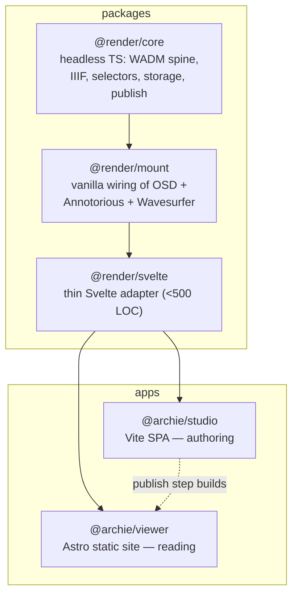

# Archie

**Annotate deep-zoom images, audio, and video in your browser — then publish a self-contained static site to GitHub Pages. No server, no database, no lock-in.**

Archie is a multi-media exhibit annotation platform. You author in a browser **Studio**, draw regions on high-resolution images (or mark time-ranges on audio/video), attach notes and media, and publish a read-only **Viewer** site. Annotations are stored as [W3C Web Annotation Data Model](https://www.w3.org/TR/annotation-model/) (WADM) records and laid out on disk as [IIIF Presentation 3](https://iiif.io/api/presentation/3.0/) — so your work is portable, standards-based, and readable by third-party IIIF tools.

> [!NOTE]
> **Status: Phase 2 in progress.** The data layer and both apps are built and have been dogfooded on real exhibits (the Voynich folios and a Bidar map with 25 annotated regions). Browser-regression verification is still pending, and several Phase-3 features are not yet built — see [Status & roadmap](#status--roadmap).

---

## Contents

[Why Archie](#why-archie) · [Features](#features) · [Architecture](#architecture) · [Installation](#installation) · [Quickstart](#quickstart) · [Status & roadmap](#status--roadmap) · [Core concepts](#core-concepts) · [Documentation](#documentation) · [License](#license)

## Why Archie

- **Standards on disk, not in a vendor format.** Notes are WADM `Annotation`s; an exhibit is an IIIF `Manifest`; objects are `Canvas`es. A published exhibit's annotation pages render in Mirador / Universal Viewer, not just in Archie.
- **Static output.** Publish produces a folder (or a `.archie.zip`) of HTML + JSON + media that drops onto GitHub Pages, Netlify, or any static host. The Viewer needs no backend.
- **Multi-media, multi-object.** One exhibit can hold many images, audio, and video objects, with notes at the library, exhibit, object, region, and time-range level.
- **Linkable, navigable notes.** Cite one note from another (`⌘K`), deep-link straight to a region (`#/a/<id>`), and let visitors move through prose-led or object-led readings.
- **Versioned by design.** Annotations live on an append-only log with a version-parent DAG, so edits are non-destructive and concurrent changes can be merged.

## Features

What works today (data layer fully tested; app surfaces built and dogfooded, browser-verify pending):

| Area | Capability |
|------|------------|
| **Image annotation** | OpenSeadragon deep-zoom + Annotorious; rectangle / polygon / ellipse / path regions → WADM selectors |
| **A/V annotation** | Import VTT/SRT transcripts, mark time-range notes, click-to-seek cue linking |
| **Data model** | Append-only log → version DAG → heads/history projection; non-destructive edits + multi-parent merge |
| **IIIF** | Exhibit → `Manifest`, object → `Canvas`, per-canvas `AnnotationPage` heads; Presentation 3 on disk |
| **Storage** | Three backends behind one seam — in-memory, `.archie.zip` (anywhere), and File System Access folders (Chromium autosave) |
| **EXIF** | Read orientation, generate an upright display master, preserve the original |
| **Linking** | `⌘K` cite/insert across the library, deep-link arrival, link validation |
| **Reading modes** | Single (OSD + 3-state pane), Grid (object gallery), Narrative (prose spine + map canvas) |
| **Publish** | Whole library → `.archie.zip` download **or** GitHub Pages push (Contents API) |

## Architecture

Archie is a pnpm monorepo. A three-layer rendering core (headless → vanilla DOM → Svelte) is shared by two apps that never depend on each other's code — only on the published `@render/*` contract.



| Workspace | Name | What it is |
|-----------|------|------------|
| `packages/render-core` | `@render/core` | Pure, headless TypeScript: WADM types + annotation spine, IIIF manifest generation, selector/geometry, the `Filesystem` seam, publish projection, EXIF, linking, A/V. No DOM. |
| `packages/render-mount` | `@render/mount` | Framework-free wiring of OpenSeadragon + Annotorious + Wavesurfer behind an imperative surface (`fitBounds` / `setSelected` / `destroy`) + an `onSelect` callback. |
| `packages/render-svelte` | `@render/svelte` | Thin Svelte reactivity adapter over `@render/mount`. Kept under ~500 LOC as a logic-leak detector. |
| `apps/studio` | `@archie/studio` | The authoring app — a Vite Svelte SPA. Library browser, canvas editor, A/V editor, merge-review, publish dialog. See [apps/studio/README.md](apps/studio/README.md). |
| `apps/viewer` | `@archie/viewer` | The published site — Astro with Svelte islands. Gallery landing + per-exhibit readers. See [apps/viewer/README.md](apps/viewer/README.md). |

Deeper maps live in [`docs/architecture/`](docs/architecture/) (subsystem components + contracts). Design rationale is in the [ADRs](docs/adr/) and [decision records](docs/decisions/).

## Installation

**Prerequisites:** Node.js ≥ 22 and pnpm 10 (the repo is a pnpm workspace).

> [!IMPORTANT]
> The repo was last developed against Node 20, where `pnpm install` / `pnpm test` fail with a version-engine error. Switch to Node 22+ first (e.g. `nvm install 22 && nvm use 22`).

```bash
pnpm install            # install the whole workspace (run from the repo root)
```

## Quickstart

Verify the workspace, then run an app:

```bash
pnpm typecheck          # type-check every package + app
pnpm build              # build every package + app
pnpm test               # run the full test suite (requires Node 22+)
```

### Run the Studio (authoring app)

```bash
pnpm --filter @archie/studio dev      # Vite SPA on http://localhost:5173
```

Open it, pick or create an exhibit, draw a region, attach a note, and use the publish dialog to download a `.archie.zip` or push to GitHub Pages.

### Run the Viewer (published reader)

```bash
pnpm --filter @archie/viewer gen      # generate the static published tree first
pnpm --filter @archie/viewer dev      # Astro dev server on http://localhost:4321
```

The Viewer reads the static tree built by `gen` (the same projection the Studio's publish step emits). The bundled Voynich and Bidar exhibits load out of the box.

Target a single workspace with `--filter`, e.g. `pnpm --filter @render/core test` or `pnpm --filter @archie/studio build`.

## Status & roadmap

**Tests:** 290 tests last passed locally on 2026-05-25 (per [`HANDOFF.md`](HANDOFF.md): `@render/core` 241, `@render/mount` 18, `@render/svelte` 18 — counts approximate, re-run to confirm). `pnpm test` currently requires Node ≥ 22.

**Phase 2 — in progress.** Both apps are built and dogfooded on the Voynich and Bidar exhibits. Owed before Phase 2 closes: browser-regression verification, and minor polish (styled A/V scrubber + `mm:ss` time inputs, publish-originals opt-in, a broken-links surface).

**Phase 3 — not yet built (gated inventions, each behind a user-comprehension gate):**
- Overview-as-canvas (a zoomable canvas instead of a list)
- Local identity prompt on first import
- Grid slideshow sub-mode (step through fullscreen)
- Narrative section-authoring UI (sections currently derive from order)
- Viewer: breadcrumb / zoom-to-fit chrome, IIIF Content-State arrival (`?iiif-content`)

The phasing and gate mechanism are described in [`docs/IMPLEMENTATION-STRATEGY.md`](docs/IMPLEMENTATION-STRATEGY.md).

## Core concepts

Archie uses a precise vocabulary (full glossary in [`CONTEXT.md`](CONTEXT.md)):

- **Library** — top-level container for one project; on disk a directory or zip; an IIIF `Collection`.
- **Exhibit** — one published narrative artifact; an IIIF `Manifest`. Owns its objects, media, notes, and narrative.
- **Object** — one media item inside an exhibit (image / audio / video / embed); an IIIF `Canvas`.
- **Note** — a single WADM `Annotation`, targeting a library, exhibit, object, region, or time-range.
- **Layer** — a named, toggleable grouping of notes with editorial intent; an IIIF `AnnotationCollection`.
- **Section** — one ordered unit of an exhibit's narrative; an IIIF `Range`.
- **Studio** / **Viewer** — the authoring app / the read-only published site.

## Documentation

| Doc | What it covers |
|-----|----------------|
| [`CONTEXT.md`](CONTEXT.md) | Domain language, locked frames, full glossary |
| [`docs/README.md`](docs/README.md) | Index to all design docs |
| [`docs/adr/`](docs/adr/) | Architecture Decision Records (0001–0004) |
| [`docs/decisions/`](docs/decisions/) | Citable decision records (Q-N) |
| [`docs/architecture/`](docs/architecture/) | Subsystem component + contract maps |
| [`docs/IMPLEMENTATION-STRATEGY.md`](docs/IMPLEMENTATION-STRATEGY.md) | Phasing, sequencing, validation gates |

## License

No license file is present yet. Until a `LICENSE` is added, all rights are reserved by the authors; contact the maintainers before reuse.
