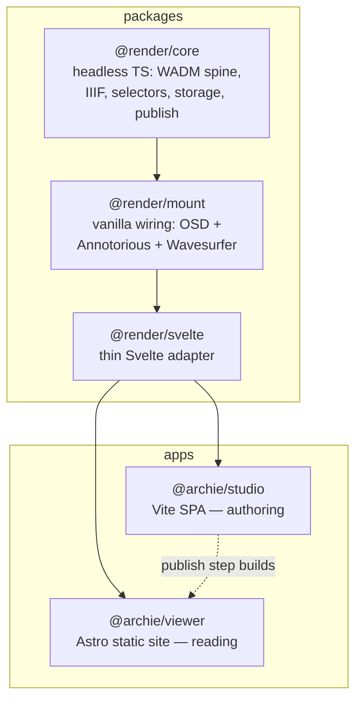

# Archie

**Annotate deep-zoom images, audio, and video in your browser — then publish a self-contained static site. No server, no database, no lock-in.**

---

## What you can build

Archie turns your media into interactive, linkable exhibits that live on the web as plain files.

| You want to... | You do this in Archie |
|---|---|
| **Annotate a historic map** | Open the high-res image, draw regions, attach notes. Publish. Visitors explore your annotations on the map. |
| **Build a multimedia essay** | Combine images, audio clips, and video in one exhibit. Write a narrative spine that guides readers through each object. |
| **Create a scholarly edition** | Transcribe and annotate manuscript pages. Link notes to each other. Export as IIIF — readable in Mirador, Universal Viewer, or any IIIF tool. |
| **Publish without a server** | Author in the browser. Publish produces a folder of HTML + JSON + media. Drop it on GitHub Pages, Netlify, or any static host. |

The bundled exhibits — a 5-folio Voynich manuscript set and a 25-region Bidar map — show what a finished exhibit looks like.

## Screenshots

### Studio — authoring


*Exhibit overview: every object on one zoomable canvas — drag to pan, scroll to zoom, drag objects to set the reading order.*


*Canvas editor: draw rectangle or polygon regions on a deep-zoom object and annotate at the canvas-anchored popover (shown on a video object, with a time-window selector).*


*Audio annotation: WaveSurfer waveform — drag to create time-range notes, import VTT/SRT transcripts.*


*Narrative spine: author sections with framed cameras, reorder beats, switch objects on the rail.*

### Viewer — published site


*Narrative reading: the prose spine drives the canvas — each section frames its region of the exhibit map.*


*Narrative reading with media: audio and video play inline as the reader moves through the spine.*

> [!NOTE]
> **Status: v1 nearly complete.** The data layer, both apps, and all major Phase 3 features are built and dogfooded. Browser-regression verification is owed on several features — see [Status & roadmap](#status--roadmap).

## Why Archie

- **Standards on disk, not in a vendor format.** Notes are [W3C Web Annotation](https://www.w3.org/TR/annotation-model/) records. Exhibits are [IIIF Presentation 3](https://iiif.io/api/presentation/3.0/) manifests. Your work is portable and readable by third-party IIIF tools.
- **Static output.** Publish produces a folder (or `.archie.zip`) that drops onto GitHub Pages, Netlify, or any static host. The Viewer needs no backend.
- **Multi-media, multi-object.** One exhibit holds many images, audio, and video objects, with notes at the library, exhibit, object, region, and time-range level.
- **Linkable, navigable notes.** Cite one note from another (<kbd>Cmd</kbd> + <kbd>K</kbd>), deep-link to a region (`#/a/<id>`), and let visitors move through prose-led or object-led readings.
- **Versioned by design.** Annotations live on an append-only log with a version-parent DAG. Edits are non-destructive and concurrent changes can be merged.

## Quickstart

**Prerequisites:** Node.js ≥ 22 and pnpm 10.

```bash
pnpm install            # install the whole workspace
pnpm typecheck          # type-check every package + app
pnpm test               # run ~330 tests
```

### Run the Studio (authoring)

```bash
pnpm --filter @archie/studio dev      # opens http://localhost:5173
```

Pick or create an exhibit, draw a region, attach a note, publish.

### Run the Viewer (reading)

```bash
pnpm --filter @archie/viewer gen      # generate the published tree
pnpm --filter @archie/viewer dev      # opens http://localhost:4321
```

Target a single workspace with `--filter`, e.g. `pnpm --filter @render/core test`.

## Workflow — from clone to published site

The whole author's arc, end to end:

**1. Clone and stand up the repo.**

```bash
git clone https://github.com/micahchoo/Archie.git archie && cd archie
nvm install 22 && nvm use 22       # Node ≥ 22 is required
pnpm install                       # install the whole workspace
pnpm --filter @archie/studio dev   # opens http://localhost:5173
```

**2. Create an exhibit.** In the library home, type a title into **New exhibit title…** and create it. The bundled Voynich and Bidar sets are *examples* — open one to explore, then **Keep a copy** to fork it into a saved exhibit of your own.

**3. Add your objects.** Drop an image onto the canvas, or use **+ Object** on the rail to add an image, audio, or video object. The **exhibit overview** lays every object on one zoomable canvas — drag them to set the reading order.

**4. Annotate.** On an image or video, draw a rectangle/polygon region and write the note in the canvas-anchored popover; on audio, drag across the waveform to create a time-range note. Tag notes, group them into layers, and cite one note from another with <kbd>Cmd</kbd> + <kbd>K</kbd>.

**5. Write a narrative.** Switch to the narrative spine, add sections, and frame a camera on the canvas for each beat. Reorder sections and switch objects on the rail to shape the reading.

**6. Preview the published site (optional).**

```bash
pnpm --filter @archie/viewer gen   # generate the static tree
pnpm --filter @archie/viewer dev   # opens http://localhost:4321
```

**7. Deploy to GitHub Pages.** In the Studio, open **Publish → Connect to GitHub**. Enter your repo **owner** and **name**, a branch (defaults to `gh-pages`), and a [fine-grained personal access token](https://github.com/settings/tokens?type=beta) with **`contents: write`** scope. Archie pushes the whole library — every exhibit — to that branch via the GitHub Contents API; the token is used once and never stored. Then, in your repo's **Settings → Pages**, set the source to the `gh-pages` branch. Your site goes live at `https://<owner>.github.io/<repo>/`.

> [!NOTE]
> The push lands your whole library's data (IIIF manifests, annotations, media) on the branch. Today the Viewer ships fixed routes for the bundled sample exhibits — rendering *arbitrary* user-created exhibits on the published site is still [owed work](#status--roadmap).

## Features

| Area | Capability |
|---|---|
| **Image annotation** | OpenSeadragon deep-zoom + Annotorious; rectangle and polygon regions; canvas-anchored popover form |
| **Audio annotation** | WaveSurfer waveform; drag to create time-range notes; import VTT/SRT transcripts |
| **Video annotation** | Spatiotemporal — draw a box on a paused frame + set a time window; combined `xywh=&t=` selectors |
| **Data model** | Append-only log with version-parent DAG; heads/history projection; non-destructive edits; multi-parent merge; schema migration |
| **IIIF** | Exhibit → `Manifest`, object → `Canvas`, per-canvas `AnnotationPage`; layers as `AnnotationCollection`; narrative sections as `Range`; Presentation 3 on disk |
| **Storage** | Three backends behind one seam — OPFS (browser), `.archie.zip` (portable), File System Access (Chromium folder autosave) |
| **EXIF** | Read orientation, bake upright display master, preserve original with provenance metadata |
| **Linking** | <kbd>Cmd</kbd> + <kbd>K</kbd> cite/insert across the library; deep-link arrival (`#/a/<id>`); broken-link detection at publish |
| **Reading modes** | Single (deep-zoom), Grid (thumbnail gallery), Narrative (prose spine with camera framing); overview-as-canvas (zoomable exhibit map, drag-to-reorder) |
| **Publish** | Whole-library → `.archie.zip` download, GitHub Pages push, or local folder (Chromium); opt-in source-originals for citation |
| **Collaboration** | Silent DAG merge; conflict-card resolution; identity prompt on first import |

## Installation

```bash
pnpm install
```

> [!IMPORTANT]
> The repo requires Node.js ≥ 22. Older versions fail with a version-engine error. Switch first: `nvm install 22 && nvm use 22`.

## Architecture

Archie is a pnpm monorepo. A three-layer rendering core (headless → vanilla DOM → Svelte) is shared by two apps that never depend on each other's code — only on the published `@render/*` contract.



| Workspace | Package | What it is |
|---|---|---|
| `packages/render-core` | `@render/core` | Pure TypeScript: WADM types, annotation spine, IIIF manifests, selectors, storage seam, publish, EXIF, linking, A/V. No DOM. (60 source files) |
| `packages/render-mount` | `@render/mount` | Framework-free wiring of OpenSeadragon + Annotorious + Wavesurfer behind an imperative surface. (11 source files) |
| `packages/render-svelte` | `@render/svelte` | Thin Svelte 5 reactivity adapter over `@render/mount`. (9 source files) |
| `apps/studio` | `@archie/studio` | Authoring SPA — library browser, canvas editor, A/V editor, merge review, publish dialog. |
| `apps/viewer` | `@archie/viewer` | Published reader — Astro with Svelte islands, gallery landing, per-exhibit readers. |

### Where to start in the code

**Understanding the data model** (work inward from the edges):
- `packages/render-core/src/wadm/types.ts` — the W3C annotation types
- `packages/render-core/src/wadm/brand.ts` — branded ULID identity types (LogicalId, RevId, VersionId) that prevent type confusion
- `packages/render-core/src/model/model.ts` — Library, Exhibit, Object, Note domain model

**Understanding the annotation spine** (the versioning core):
- `packages/render-core/src/spine/log.ts` — append-only log (highest-degree node in the graph: 14 edges)
- `packages/render-core/src/spine/heads.ts` — multi-head projection for concurrency
- `packages/render-core/src/spine/merge.ts` — three-way merge resolution
- `packages/render-core/src/spine/serialize.ts` — on-disk persistence format

**Understanding how it all wires together**:
- `packages/render-core/src/index.ts` — the barrel export (34 re-exports, the codebase map)
- `packages/render-core/src/fs/seam.ts` — the filesystem abstraction (3 backends, 1 interface)
- `packages/render-mount/src/mount.ts` — where OSD + Annotorious get wired to the render surface
- `apps/studio/src/store.ts` — the Studio's OPFS working store (where core packages meet the authoring UI)

**Additional maps:** [`docs/architecture/`](docs/architecture/) (subsystem components + contracts), [`docs/adr/`](docs/adr/) (ADRs), [`docs/decisions/`](docs/decisions/) (Q-N decision records).

## Core concepts

Archie uses a precise vocabulary. One-sentence definitions below; full glossary in [`CONTEXT.md`](CONTEXT.md).

- **Library** — top-level container for one project; on disk a directory or zip; an IIIF `Collection`.
- **Exhibit** — one published narrative artifact; an IIIF `Manifest`. Owns its objects, media, notes, and narrative.
- **Object** — one media item inside an exhibit (image / audio / video / embed); an IIIF `Canvas`.
- **Note** — a single WADM `Annotation`, targeting a library, exhibit, object, region, or time-range.
- **Layer** — a named, toggleable grouping of notes with editorial intent; an IIIF `AnnotationCollection`.
- **Section** — one ordered unit of an exhibit's narrative; an IIIF `Range`. Independent of Notes — Sections point at Notes via links, not structural references.
- **Studio** / **Viewer** — the authoring app / the read-only published site.

## Status & roadmap

**Tests:** ~330 tests (295 `@render/core`, 18 `@render/mount`, 18 `@render/svelte`). Requires Node ≥ 22.

**v1 — nearly complete.** The data layer, both apps, and all major features are built and dogfooded on Voynich (5-folio manuscript) and Bidar (25-region annotated map) exhibits. Both apps build clean (Studio ~199 modules).

**Shipped:**
- Overview-as-canvas — zoomable exhibit map with drag-to-reorder reading order
- Narrative section-authoring — frame cameras on canvas, reorder spine, publish as IIIF Ranges
- Audio annotation — WaveSurfer waveform, drag-to-create time-range notes, transcript import
- Video spatiotemporal annotation — frame-box + time-window combined selectors
- Canvas-anchored note popover — edit at the marker, nav-only sidebar
- <kbd>Cmd</kbd> + <kbd>K</kbd> intra-Library linking — cite notes/exhibits, broken-link detection at publish
- EXIF display-master bake — upright master from phone photos, original preserved
- Three-config persistence — OPFS / folder autosave / `.archie.zip` file, with recent-projects list
- Playground vs project per-exhibit model — examples are ephemeral, user exhibits persist
- Layout picker — spatial arrangement + reading-mode axes, grouped by reading family
- Identity prompt — local display name, prompted on first merge (never at launch)

**Owed (browser-verify / polish):**
- Viewer dynamic routes — render arbitrary user-created exhibits on the published site (today the Viewer ships fixed routes for the bundled Voynich / Bidar / AV samples)
- Browser-regression verification on AV editor, overview canvas, popover, and persistence flows
- Video spatiotemporal — Viewer-side read (studio authoring done)
- Grid slideshow sub-mode
- Viewer breadcrumb navigation and IIIF Content-State arrival
- Overview section dividers (deferred — model (A) makes them largely redundant)

The full phasing and gate mechanism is in [`docs/IMPLEMENTATION-STRATEGY.md`](docs/IMPLEMENTATION-STRATEGY.md). Deferred-work registry in that doc is the canonical remaining-work list.

## Documentation

| Doc | For |
|---|---|
| [`CONTEXT.md`](CONTEXT.md) | Domain language, locked design frames, full glossary |
| [`docs/README.md`](docs/README.md) | Index to all design docs |
| [`docs/architecture/overview.md`](docs/architecture/overview.md) | Architecture map (start here as a developer) |
| [`docs/architecture/subsystems/`](docs/architecture/subsystems/) | Per-subsystem component + contract maps |
| [`docs/adr/`](docs/adr/) | Architecture Decision Records (0001–0006) |
| [`docs/decisions/`](docs/decisions/) | Citable decision records (Q-N) |
| [`docs/IMPLEMENTATION-STRATEGY.md`](docs/IMPLEMENTATION-STRATEGY.md) | Phasing, sequencing, validation gates |
| [`HANDOFF.md`](HANDOFF.md) | Agent-to-agent session continuity |

## Contributing

Pull requests are welcome. Before opening one:

1. Run `pnpm typecheck` and `pnpm test` — both must pass.
2. For new features, include tests. The suite lives alongside source (`*.test.ts`), not in a separate directory.
3. Architecture decisions go in `docs/adr/` (new) or `docs/decisions/` (Q-N citation). Design discussion belongs in an issue before a PR.
4. The rendering core (`@render/core`) is pure TypeScript with no DOM dependencies — keep it that way. Browser APIs belong in `@render/mount` or the apps.

See [`docs/architecture/overview.md`](docs/architecture/overview.md) for the subsystem map and [`CONTEXT.md`](CONTEXT.md) for the domain language used throughout the codebase.

## License

No license file is present yet. Until a `LICENSE` is added, all rights are reserved by the authors; contact the maintainers before reuse.
