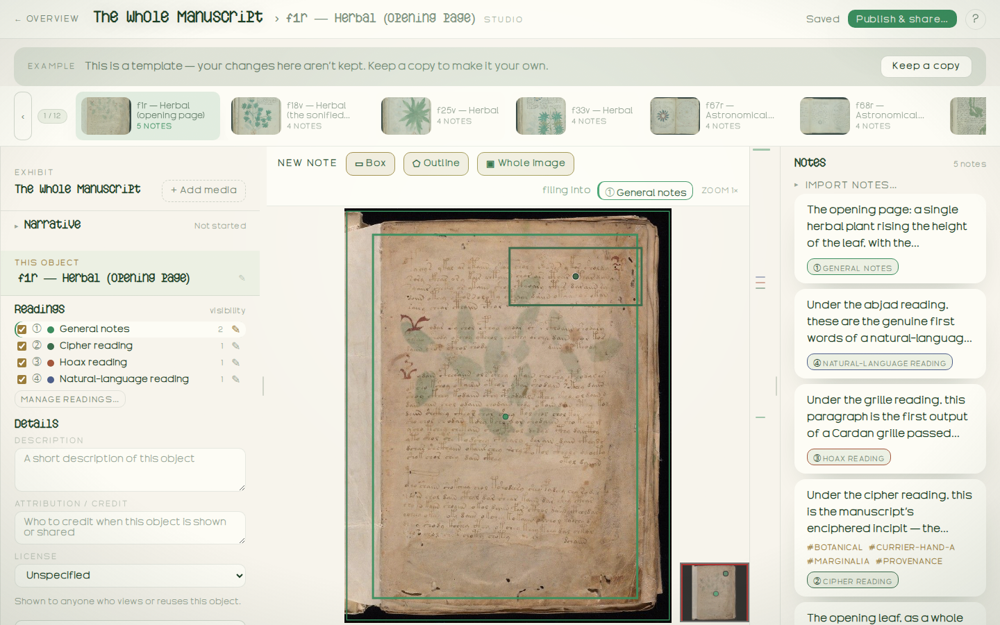

# Archie

Annotate images, maps, audio, and video. Publish your notes as a website or share a portable file.

Use **Studio** to import media, mark regions or moments, and write notes. Readers explore the result in **Viewer**.
An exhibit can present several interpretations of the same source, called **Readings**, or guide readers through a narrative.



Your notes use W3C Web Annotation, and exhibits use IIIF Presentation 3. The published website needs no application server or database.
You can host it yourself or share a `.archie.zip` file. Remote images, tiles, and recordings still need a connection.

## Quickstart

Install Node.js 24, pnpm 9 or newer, and Git LFS. Then run:

```bash
git lfs install
git clone https://github.com/micahchoo/Archie.git
cd Archie
pnpm install
sh qa/hooks/install.sh
pnpm dev
```

Open [Studio](http://localhost:5173/studio/) to create an exhibit, or [Viewer](http://localhost:5173/viewer/) to explore the examples.
Both apps share one local address, so Viewer can read your browser's working library.

The examples are a playground. Choose **Keep a copy** before you edit an example you want to save.
Browser saves stay in that browser. They do not make your work public.

For a launcher menu, open `start.cmd` on Windows, `start.command` on macOS, or `start.sh` on Linux.

## Publish or embed

**Publish** creates a website. **Export a copy** creates a file you can download and share.
Storage and publishing options differ between browser and desktop Studio. See the [capability matrix](docs/CAPABILITIES.md).

The [publishing guide](docs/guide/06-publish.md) covers the workflow.
To put an exhibit inside an existing website, use the [`<archie-viewer>` embed guide](recipes/EMBED.md).

## Development

Archie is a pnpm workspace. The shared TypeScript core handles annotations, storage, and publication.
Studio uses Vite and Svelte. Viewer uses Astro and Svelte. The [codebase map](hubs/INDEX.md) explains each area.

```bash
pnpm typecheck
pnpm test
pnpm build
```

Tests live beside the source. Pull requests must pass the relevant checks. [Verification](hubs/verification.md) lists browser and package-specific gates.

## Documentation

| Start here | For |
|---|---|
| [User guide](docs/guide/) | Your first exhibit, from import to publication |
| [Capabilities](docs/CAPABILITIES.md) | Storage, offline behavior, undo, and delivery differences |
| [Desktop development](src-tauri/README.md) | Build and run the desktop app |
| [Codebase map](hubs/INDEX.md) | Find the relevant code and checks |
| [Domain model](CONTEXT.md) | Terms and product decisions |

Licensed under [GPL-3.0-only](LICENSE). Copyright © 2026 Micah.
