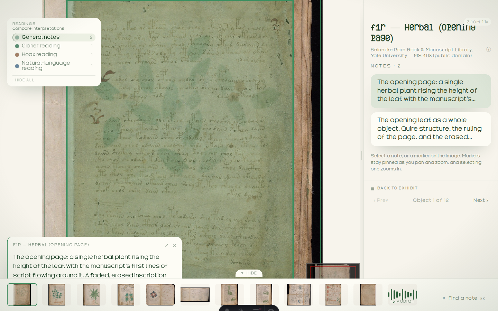

# What is Archie?

Archie turns images, maps, audio, and video into exhibits that visitors explore
in a browser. You attach notes to regions or moments, then publish a folder of
files. A static web host can serve those files without an application server or
database.

Visitors can open a folio, zoom into a region, and read its notes. Readings offer
different interpretations of the same material. Narrative sections guide visitors
through an exhibit in order.

The **Studio** is where you author the exhibit. The **Viewer** is where visitors
read it. Published pages include static prose and links. The interactive reader
adds zoom, media playback, and navigation.

Offline access depends on the app and its media. Local assets can travel with an
export, but remote images, maps, and recordings still need their source.
[Delivery capabilities](../CAPABILITIES.md) describes these limits for each version
of Archie.

→ Next: [Your library](01-your-library.md)
