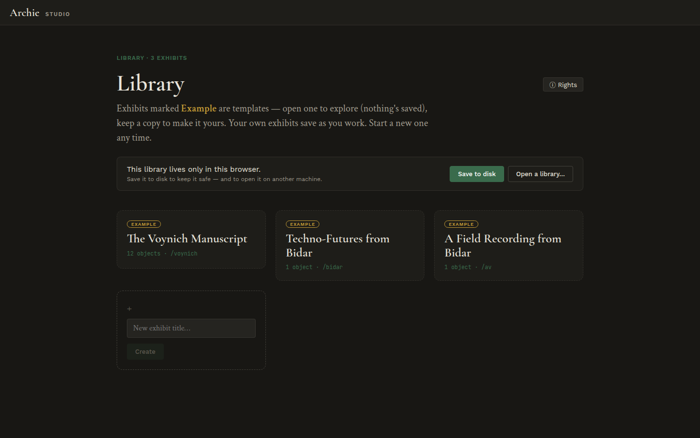

# Your library

The library is your workspace. Every exhibit you are building lives here, and
this is where you start a new one.

Archie ships with three exhibits to explore, each marked **Example**:

- **Voynich manuscript** — five deep-zoom folios (a Grid exhibit).
- **Techno-Futures from Bidar** — a single annotated map.
- **A Field Recording from Bidar** — an audio object.

Open an example to look around — but it is a template, so your changes there
are not saved. To make one your own, use **Keep a copy**; your own exhibits
save as you work. To start fresh, type a title into **New exhibit title…** and
**Create**.

One thing to know up front: *your library lives only in this browser* until you
**Save to disk**. Saving gives you a file you can back up, move to another
machine, or **Open a library** from later.

→ Next: [Inside an exhibit](02-inside-an-exhibit.md)
