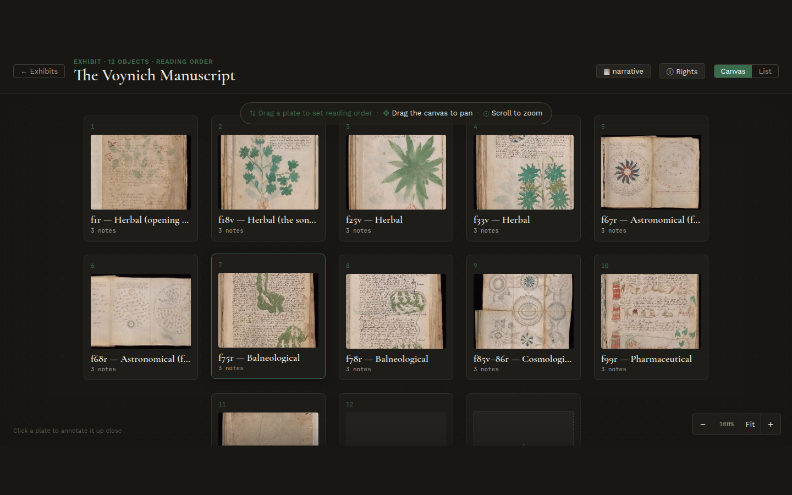

# Inside an exhibit

Open an exhibit that has several objects and you land on its overview — every
object laid out on one zoomable canvas:

This is where you arrange the order a visitor will move through. Each object is a
**plate**; drag a plate to set the **reading order** (the numbers update). Drag
the empty canvas to pan, scroll to zoom — the same gestures your visitors use.

To work on one object up close, **click its plate**. That opens the editor, where
the annotating happens (the next two pages).

> An exhibit with a single object — like **The Rosettes** — skips the overview and
> opens straight into the editor. The overview only appears when there is an order
> to arrange.

→ Next: [Annotate an image](03-annotate-an-image.md)
