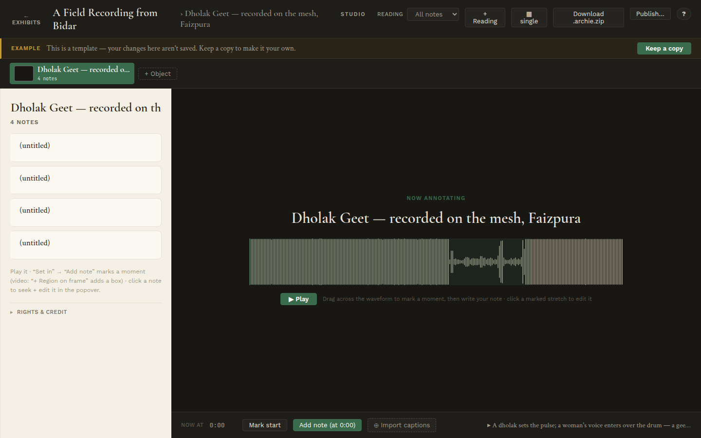

# Annotate audio & video

Audio and video objects open a temporal editor instead of the zoom canvas. The
gesture is the same idea — mark a span, attach a note — but the span is *time*.

For audio you get a waveform. **Drag across it** to mark a moment or a stretch,
then write the note. **Play** to listen; click a marked stretch to seek back and
edit its note. The note list works exactly as it does for images.

A few temporal extras:

- **Import captions** brings in a VTT or SRT transcript, so spoken content
  becomes notes you can refine.
- For **video**, the same waveform-style timeline applies, and **+ Region on
  frame** lets you draw a box on a specific frame — combining a time-window with
  a spatial region.

→ Next: [Shape the story](05-shape-the-story.md)
