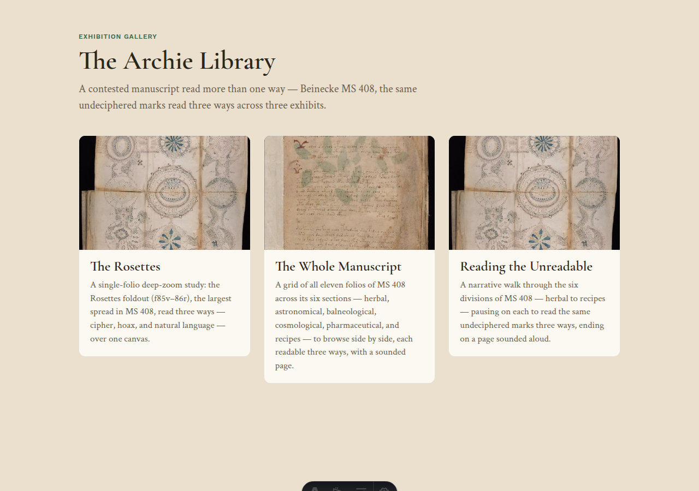
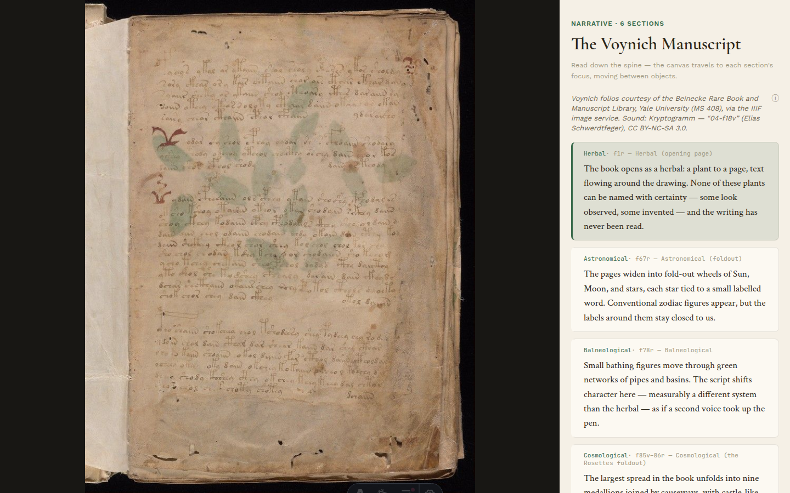

# Publish

Publishing projects your **whole library** — every exhibit — into a static site.
This closes the loop: what you authored in the Studio becomes the public Viewer.

The published site opens on a gallery of your exhibits:

…and each exhibit becomes its own page — the same folios you annotated, now live
for visitors to open, zoom into, and read three ways:

You have a few destinations, all from the **Publish…** menu:

- **Locally** — preview the published site on your machine before sharing it.
- **A portable `.archie.zip`** — download a single self-contained file and hand it
  to someone. The Viewer opens it in the browser; no host needed.
- **To GitHub Pages** — choose **Connect to GitHub**, enter your repo owner and
  name, a branch (defaults to `gh-pages`), and a fine-grained access token with
  `contents: write` scope. Archie pushes the library's data tree via the GitHub
  Contents API; the token is used once and never stored. (The project's deploy
  workflow then builds and hosts the Viewer shell alongside your data — see the
  README's *Publishing & deploying* section.)

Credit your sources as you go: each library, exhibit, and object can carry an
attribution and a license, edited under **Details & rights** in the Studio. The
Viewer shows a quiet credit line, with the full license behind an ⓘ disclosure.

Your site goes live at `https://<owner>.github.io/<repo>/` — plain files,
standards on disk ([W3C Web Annotation](https://www.w3.org/TR/annotation-model/)
notes, [IIIF Presentation 3](https://iiif.io/api/presentation/3.0/) manifests),
readable by other IIIF tools and yours to keep.

← Back to the [guide index](README.md)
